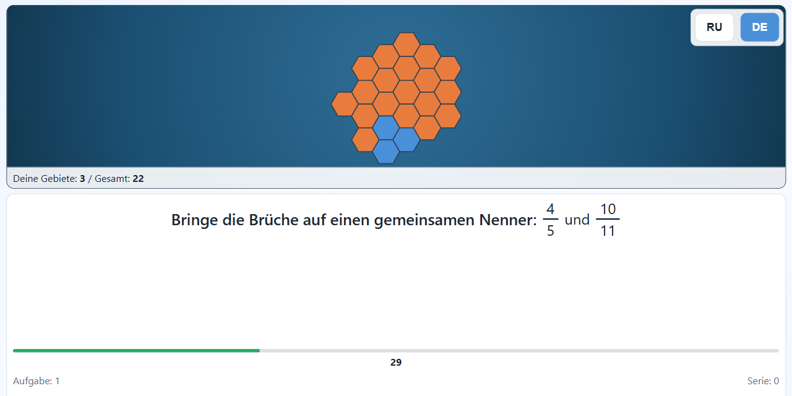

# Fraction Conquest (Покорение дробей)

**[▶ Играть в браузере](https://gluonmaster.github.io/fraction-conquest/)** · [English](README.md) · [Deutsch](README.de.md)

Игра-тренажёр по дробям для 5–7 классов (11–13 лет). Каждый правильный ответ захватывает территорию на карте, каждый неверный отдаёт её обратно, и тренировка превращается в небольшую стратегическую партию. Учитель или родитель выбирает темы и сложность. Игра работает в браузере, на немецком или русском, без установки и регистрации.



## Возможности

- 11 тем: сокращение, смешанные числа, общий знаменатель, четыре действия, переход между обыкновенными и десятичными дробями, комбинированные примеры.
- 4 уровня сложности.
- Мгновенная обратная связь и пояснение после каждой ошибки.
- Страница настроек ([admin.html](admin.html)): темы, сложность, таймер.
- Страница тестов ([test.html](test.html)) для проверки математического движка в браузере.
- Чистые HTML, CSS и JavaScript, без фреймворков и сборки.

## Управление

- Клик по одному из шести ответов или клавиши `1`–`6`.
- После ошибки прочитайте пояснение и переходите к следующему заданию.

## Запуск на своём компьютере

Скачайте или клонируйте репозиторий и откройте `index.html` в браузере. Через локальный сервер игра работает так же, как онлайн-версия:

```bash
python -m http.server 8000
```

Затем откройте `http://localhost:8000/index.html` (или `admin.html`, `test.html`). Игра рассчитана на экраны от 1024×768 в актуальных Chrome, Firefox и Edge. Настройки и прогресс хранятся в `localStorage` браузера.

## Автор и лицензия

Разработал Dr. Konstantin S. Shakun с помощью ИИ-агентов для программирования. Код распространяется по [лицензии MIT](LICENSE).
